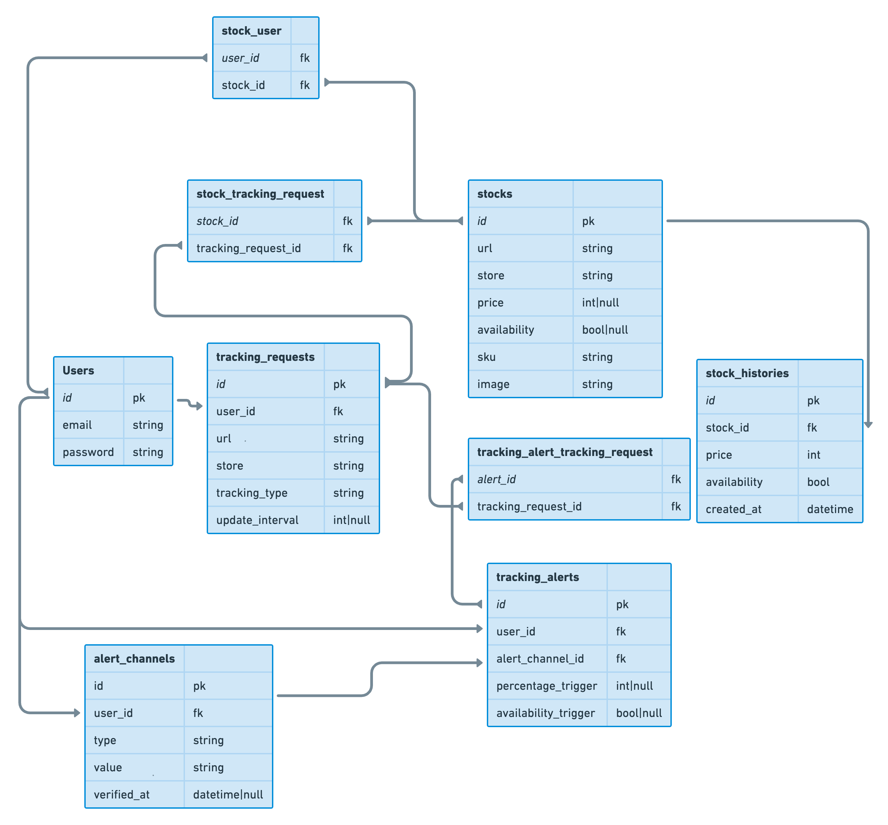

# Laravel Stock tracking
#### Track availability and price of products at several stores

## Installation
This application uses . Please clone before moving on.

```shell
> laravel-stock $ cp .env.example .env
> laravel-stock $ composer install
> laravel-stock $ php artisan key:generate
> laravel-stock $ php artisan migrate
> laravel-stock $ echo "PATH_TO_PYTHON_EXECUTABLE=$(which python3.10)" >> .env
> laravel-stock $ echo "PATH_TO_PYTHON_UNDETECTED_CHROME_SCRIPT=/path/to/other/repo/main.py/here" >> .env
> laravel-stock $ mkdir -p storage/app/tmp
```
**Note**: Google Chrome is required for this application to work. Please make sure you have it installed.

## Testing the store scrapers
```shell
> laravel-stock $ php artisan test --filter=ServiceTest
```

## Database structure

